## Contents

- Using Unreal A.R.T. (Unreal Animating Real-time Textues manual)
    - Introduction
    - Applications
    - Timing and frame rates
    - Performance and memory

- Creating animating textures
    - Basics
    - Palettes and color
    - Fire textures
    - Wave textures
    - Wet textures
    - Ice textures

## Using Unreal A.R.T.

### Introduction

Unreal's 'Animating Real-time Textures' technology (working title 'fire engine’) enables users to create and apply realistic dynamic
textures immediately from within the Unreal editor.

### Applications

The real-time animating textures can be used almost anywhere in Unreal; on surfaces, moving brushes, and even actors. All of the animating
real-time textures do not maintain mip-maps, which means they do not have special scaled-down versions to look good at various distances.
Most effects however have a smooth appearance and scale really well even without mip-mapping.

Transparent surfaces provide one of the coolest uses for the fire and wave textures. Positioned in cross-, star- or more elaborate
formations, fire can look almost volumetric. Microtextures can also benefit from animation in special cases.

The water, wet- and ice-textures can convey much more than realistic water surfaces; used as a general means of warping source art in a
noisy pattern, force-fields, swirly energy bursts and convincing turbulent flames are just a few of the possibilities.

### Timing and frame rates

Fire, wave-and wet-textures are updated iteratively; the new frame takes the state of the last frame as its input, and then updates the
texture.

This means such textures may need some warming-up time in order to look the way they're supposed to; for this you can set the PrimeCount
parameter in the texture's animation properties to an appropriate number of iterations. This does not apply to Icetextures, the speed of
which can be made explicitly frame-independent - see the IceTextures chapter.

Each texture has two basic parameters that determine the update rate at game-time, as well as at editor-time: MinFrameRate and MaxFrameRate,
in the Animation panel of a texture's properties window. By default, both are zero, and the texture's update code will be called whenever a
new frame is rendered in the game, so it will follow the framerate of the game. The advantage of this is a consistently smooth animating
effect, but this may be too fast or too slow depending on the design context.

If you specify nonzero values, the framerate at which the texture updates itself is forced to be anywhere between these two rates. As long
as the framerate at game-time falls within these two limits, the resulting behavior is still one texture update each frame.

This is also useful temporarily when editing the dynamic texture in the editor on fast computers, where the rate of frame updates may be too
high to get a realistic impression of in-game behavior. Regardless of these settings, a dynamic texture is never updated when it is out of
view.

Fire and water textures may need some 'warming up' time to attain a stable appearance - e.g. a flame needs to fade out to fill a texture,
and waves need some time to spread out. When it is essential for your level to avoid visible texture bootstrapping, you can set the
PrimeCount variable to some (low) "warming-up" value, from the properties / Animation panel.

### Performance and memory

Each frame of an animating texture is created in real-time. This has obvious memory benefits over storing pre-rendered sequences. While all
the effects use highly optimized code, displaying scenes with a lot of different large animating textures can have some negative effect on
the frame rate. However, animating textures are not updated when no part of them appears on the screen; so you can still use many (large)
animating textures in a single level as long as most of them are not visible at the same time. It's also efficient to use the same texture
for multiple objects, like torchflames.

Performance slowdown is directly proportional to the number of pixels in a texture, so don't use a large texture where a smaller one would
suffice. If you like, play around drawing stuff on a large texture, but then re-create the final desired effect on a texture that's just big
enough to encompass it. Some large, detailed, 256 by 256 pixel dynamic textures may be essential to your level design; but in other cases,
try obtaining the same effect using a scaled-up or tiling smaller texture.

After the texture size itself, the second concern is the number of particle actors that make up all effects in the fire and water textures;
these are a limited resource. You quickly run out of these if you use the ones that emit clouds and other stuff. Fire sparks have a special
adjustable maximum limit SparksLimit. This amount of sparks is the actual space that gets allocated during game-time; by making this as
small as possible after you finalize your fire design you achieve an optimal use of memory. This is not a big deal usually since each single
spark or lightning bolt takes up only 8 bytes, but unless you really need it, the maximum of 8 x 8000 = 64Kbytes is best avoided.

When the number of sparks reaches the maximum limit, it forces certain spark-burst emitting types into regular feedback cycles. By adjusting
the limit, you can prevent or fine-tune this effect. As fire textures are saved, all the transient sparks are erased first and only the
source sparks are written to disk, regardless of the maximum spark limit.

Some effects present a bigger performance load than others; for example the lightning effects in a fire texture, and lines and clamped
squares in the water textures are more expensive than most simpler drops and sparks.

Everything tiles in all directions. All stuff, sparks, drops, waves and flames that move off one side turn up at the opposite one.
Animations look best if you avoid simple 'cyclic' schemes whenever possible - try to use some random moving sparks or oscillators with
different frequencies, to drive home the fact the texture is being generated in real-time.

## Creating animating textures

### Basics

In the Unreal editor, you create a new animating texture by clicking the 'new' button in the texture browser.

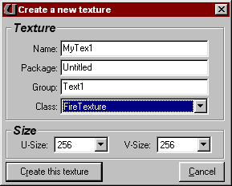

Before clicking on 'Create', make sure you have the following set up correctly since it is not possible to change most of these later:

**Name**: Change this to a descriptive, unique name.

**Package**: This is the UTX package the new texture will sit in. Remember to always save the UTX using this exact same name, otherwise
Unreal
may not be able to find the correct textures. It is recommended to create and manage your animating textures for a level in one or more
dedicated UTX packages, to avoid creating unnecessary dependencies and also because it is easy to lose them between lots of static textures.

Some types, like the 'Wet' and 'Ice' textures, refer to existing static textures; it is good practice to keep the static textures being
referred to in the same dedicated UTX, again to avoid dependencies between UTX files.

**Group**: An optional classifier, very useful in the texture browser to display special groups of textures within a single package, e.g. '
skins', 'base', 'trim', 'floor'.

**Class**: Selects one of the four types available:

- FireTexture
- IceTexture
- WaveTexture
- WetTexture

Size: Choosing the proper size for a texture is essential. In most cases it's nice to experiment on a 256x256 texture, delete it and
recreate your finalized effect on a smaller texture that's just big enough.

When a texture's editing window is visible, you can edit it directly using the mouse, in combination with the parameters in a special panel
of that texture's properties window called FirePaint, WaterPaint, or IceLayer.

All the "FX_" drawing parameters affect what you draw when you draw it, so within any one type, for example lightning, you can draw multiple
bolts on the screen with varying intensity and frequency characteristics. All other parameters affect the whole texture or certain types of
sparks globally, like renderheat.

For the fire and water effects, the left mouse button draws whatever actor is the currently active type, and the right button erases. Some
effect types are drawn as you move the mouse, others need consecutive mouse clicks. Erase large objects like lightning bolts or line
segments by moving the mouse over the starting point and clicking the right button. Erasing the swarming spark types can be tricky, usually
it is be easier to clear the texture and start again.

### Palettes and color

Coolness of any fire or water depends almost entirely on the color palette. For the Fire and Wave textures, change the palette by referring
to any other texture using the palette option in the texture panel of a texture's properties window. Clicking 'use current' will explicitly
copy the palette data from the currently selected texture to the fire or wave texture being edited. Note that, to avoid dependencies, this
behavior differs from the usual case in the texture browser, where textures which refer to other textures and/or their palettes - notably
the Wet and Ice texture types - become dependent on those textures and require their presence in order to run.

Unreal's software transparency (and its texture masking in general) uses a form of masking with holes for all color 0 pixels, so generally
you would use a ramped palette that fades to black at color 0. For most applications however, the palette is not limited in any way.

### Fire textures

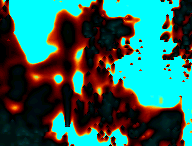 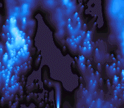 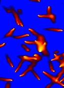

_Examples of "custom clouds" and "eels" using non-trivial color palettes_

The size of the flames can be tuned over a broad range using the `RenderHeat` slider. Two different fire algorithms exist; `bRising = false`
produces fire that doesn't move up as much as `bRising = true`. The appearance of the fire effects depends heavily on these two parameters.
`FX_Heat` determines the overall or initial brightness of most spark types. The maximum number of sparks can be adjusted
using `SparksLimit`,
for details read the above chapter on performance and memory.

It is recommended to combine sparks of different types, or the same type with different `FX_xxx` settings to obtain unique effects; for
example fountain sparks at different angles, ramped lightning, etc. can combine to amazing scenes.

Usually `FX_Frequency`, `FX_HorizSpeed`, and `FX_VertSpeed` are interpreted as signed values centered around value 128 being zero; lower
values move sparks at negative speeds, i.e. they move or circle in reverse directions.

The `SparkType` selects the effect you're drawing onto the texture. Not all of these are terribly useful, some were left in simply to
facilitate backward compatibility during Unreal's development process. The following types are available:

- `SPARK_Burn`
    - Simple, nonmoving sparks of random intensity. Looks best with `bRising = true`.

- `SPARK_Sparkle`
    - Sparks with random positional jitter over an area of horizontal size `FX_Size`, vertical size FX_AuxSize, with intensity FX_Heat.

- `SPARK_Pulse`
    - Great for pulse-trains, `FX_Frequency` sets the time frequency, and `FX_Phase` is the spatial frequency: 0=pulsed fire, use higher
      values for moving trains of sparks.

- `SPARK_Signal`
    - Like the __Burn_ spark, but this has several options to customize the graininess, brightness and intensity distribution to any desired
      output, providing a versatile base fire effect.
    - `FX_Frequency` sets the average pattern frequency, `FX_Heat` determines the ratio of bright patches to dark ones, i.e. a medium
      setting increases the contrast of the overall effect.

- `SPARK_Blaze`
    - Emits sparks in all directions.

- `SPARK_OzHasSpoken`
    - Simple up-moving, fading-out sparks.

- `SPARK_Cone`
    - Like __Blaze_, but with gravity acting on the sparks. A nice sparse effect to put at the center of complex ramped lighting bolt
      scenes, for example.

- `SPARK_BlazeRight`,  `SPARK_BlazeLeft`
    - Simple eruptions to the right and left, falling down.

- `SPARK_Cylinder`
    - Sparks moving in horizontal, 'cylindrical' orbits, with angular velocity `FX_HorizSpeed`. `FX_Heat` determines the minimum intensity,
      which always varies along a spark's orbit - this means that a low `FX_Heat` setting gives a collection of sparks a 3d-appearance, as
      if the 'backfacing' sparks are removed. `FX_Size` sets the amplitude of the orbits.
    - `DrawMode` influences the `FX_Size` dynamically; when set to any of the 'Lathe' options, as long as you keep the mouse button pressed
      while drawing, all sparks will be aligned around an invisible vertical axis so it's as if you're using a lathe. `Lathe_2`, `_3`
      and `_4` draw multiple sparks at regular spacings around the cylinder, instead of just one.
    - The way the initial position of sparks wind around the cylinder as you draw is influenced by `FX_Frequency`.

- `SPARK_Cylinder3d`
    - Like the _Cylinder_ spark, but this type makes all the 'backfaced' sparks disappear completely.

- `SPARK_Lissajous`
    - `FX_Size` determines the amplitude of the orbits, at `FX_Frequency`.
    - `FX_HorizSpeed` and `FX_VertSpeed` determine the horizontal and vertical frequencies independently. Like the _Cylinder_ type,
      individual spark intensity depends on the phase of the horizontal movement and this is always offset by `FX_Heat`.

- `SPARK_Jugglers`
    - `FX_Size` sets the amplitude of these, moving on a simple vertical sine wave pattern at `FX_Frequency`. As with _Cylinder_, the '
      back-facing' effect depends on the `FX_Heat` setting.

- `SPARK_Emit`
    - Moving in the directions set by `FX_HorizSpeed` and `FX_VertSpeed`, these glow out as they progress over straight trajectories of
      determined by both `FX_Size` and the initial heat `FX_Heat`.
    - With the speeds set to extremes (0, 128, 255) the trajectories become clean straight lines.

- `SPARK_Fountain`
    - Like _Emit_, but the sparks have gravity acting on them. A great effect for stuff like streaming lava, steam or water. Setting initial
      speeds to zero (128, 128) makes the sparks oozing down.

- `SPARK_Flocks`
    - A random moving flock of sparks drawn at `FX_Heat`, jittering in circular orbits of size `FX_Area`, with `FX_Size` being the lifetime
      of individual sparks.

- `SPARK_Eels`
    - Random cloud of straight moving sparks drawn at `FX_Heat` with lifetime `FX_Size`.

- `SPARK_Organic`
    - Fast moving sparks going upward at V-shaped angles.

- `SPARK_WanderOrganic`
    - Wandering _Organic_ sparks.

- `SPARK_RandomCloud`
    - A wandering cloud of double-speed upward moving sparks.

- `SPARK_CustomCloud`
    - Completely customizable clouds using `FX_HorizSpeed` and `FX_VertSpeed`. While moving, sparks glow up to the maximum brightness and
      then disappear. `FX_Area` determines the spark's lifetime by setting their initial brightness; a high `FX_Area` value makes sparks
      start at a lower heat so they take longer to reach full heat. Set the speeds at or around zero (128,128) to create a nice sparkly
      effect.

- `SPARK_LocalCloud`
    - Like _CustumCloud_, but the spawning points of these are random within an `FX_Area` sized square, the upper left corner of which is
      the mouse position where you draw the effect.

- `SPARK_Stars`
    - Unlike any other sparks, this one doesn't get washed out by the fire algorithm, but consists of single pixels of brightness `FX_Heat`,
      which get obscured by any fire passing across it, unless the flames have a very low intensity.

- `SPARK_LineLightning`
    - Click, stretch out the lightning to the desired end location, and release it. A low setting of `FX_Frequency` gives continuous
      lightning bolts, while a high setting makes it flash more intermittently. Most lightning looks coolest when it's kind of sparse,
      achieve this by either adjusting the RenderHeat or setting a higher `FX_Frequency`.

- `SPARK_RampLightning`
    - Like _LineLightning_, but with intensity diminishing towards the endpoint of the bolt.

- `SPARK_SphereLightning`
    - Spherically symmetrical lightning, with diameter `FX_Size`. Sparse by default, to get more coverage put a few of them on top of each
      other.
    - 
    - An example of _SphereLightning_

- `SPARK_Wheel`
    - Sparks move outward in circular orbits the size of which is determined by `FX_Area`, over a path of length `FX_Size`. They are emitted
      at an initial angle `PX_Phase`, `FX_Frequency` sets the rotation speed.

- `SPARK_Gametes`
    - Random cloud of straight moving sparks drawn at `FX_Heat` with lifetime `FX_Size`.

- `SPARK_Sprinkler`
    - Spawns upward wavy streams, `FX_Frequency` determines the speed at which the initial angle changes. `FX_Phase` controls the relative
      phase. On a low `FX_Heat` setting, a few of these can be combined together or with other effects to design smoky whirls.

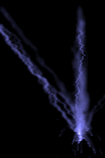 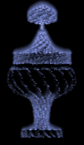 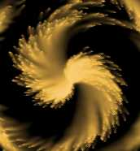

Lightning with some cone sparks at the center; some rotating cylinder sparks applied using the Lathe drawing modes to obtain a
pseudo-3d look; and a swirl made with 'wheel' sparks.

### Wave textures

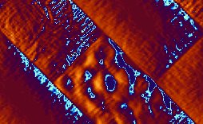

_A funky water effect using a special 2-hue palette, with some static diagonal lines creating the depressions._

The wave effect creates a pseudo-phong-shaded rendering of a physically simulated water surface.

All effects described here push, pull or clamp the height of a point or line of the surface. The default water surface level 'at rest' is
128 units high and can extend from 0 to 255. Keep this in mind when using the static effects like lines, `FixedDepth` and `AreaClamp`, which
can be made (deliberately) invisible with an `FX_Depth` of 128.

Simply throwing in some `PhaseSpots` is the quickest way to get a wavy water surface, but do remember to explicitly put in some with three
or more slightly different `FX_Frequency` values; that way, the total ripple effect never repeats and will look more random.

While some of the actual wave sources you place on a texture may look artificial, you can hide these by custom-aligning the texture on the
architecture, so only the resulting waves are visible. Placing a few line segments to clamp the surface into a beveled shape can give most
effects more depth. `BumpMapLight` defines the incident light angle in an intuitive way: moving the slider away from the middle position
brings out the depth in the image, but at the same time darkens it.

`BumpMapAngle` defines the viewer angle, which determines the position of the highlight. `PhongRange` determines how much of the palette to
reserve for the highlight, as opposed to regular shading. The same result could theoretically be achieved using custom palettes.

`PhongSize` scales the size of the highlight. `WaveAmp` scales the amplitude of the waves up or down at rendering time.

The `DropType` selects the effect you apply to the texture:

- `DROP_FixedDepth`
    - Clamps a small static spot to `FX_Depth`.

- `DROP_PhaseSpot`
    - Shakes the surface at `FX_Frequency` with relative phase `FX_Phase`. Use `PhaseSpots` with slightly varying frequencies placed close
      together to create non-repeating random looking waves.
    - Putting spots of the same frequency in a circle with a carefully tuned range of phases can make vortex-like waves.

- `DROP_ShallowSpot`
    - Like _PhaseSpot_, but half as shallow.

- `DROP_HalfAmpl`
    - Like _PhaseSpot_, but only moves below the 128-average surface level.. Useful for specific local distortions.

- `DROP_RandomMover`
    - Creates jittery waves from a randomly moving position.

- `DROP_FixedRandomSpot`
    - A fixed spot with random jittery output.

- `DROP_WhirlyThing`
    - Moves in small circles at `FX_Frequency`, pushing at `FX_Depth`.

- `DROP_BigWhirly`
    - Moves in bigger circles at `FX_Frequency`, pushing at `FX_Depth`.

- `DROP_HorizontalLine`, `DROP_VerticalLine`, `DROP_DiagonalLine1`, `DROP_DiagonalLine2`
    - Static lines of size `FX_Size`, clamping the surface to `FX_Depth`.
    - When `FX_Depth` is 128, these provide invisible barriers to waves. At other values they create nice meniscus-like beveled surfaces,
      useful for matching up with features placed onto the water surface in the level. When set up right these features can stop or reflect
      waves on the surface in realistic ways.

- `DROP_HorizontalOsc`, `DROP_VerticalOsc`, `DROP_DiagonalOsc1`, `DROP_DiagonalOsc2`
    - Lines of `FX_Size`, oscillating at `FX_Frequency`.

- `DROP_RainDrops`
    - General-purpose raindrops. Pushes the surface to `FX_Depth` at a random point within in a rectangular area of size `FX_Size`.

- `DROP_AreaClamp`
    - Clamps down a rectangle of size `FX_Size` to `FX_Depth`.

- `DROP_LeakyTap`
    - Drops of `FX_Depth` falling at a fixed position, within a regular time interval controlled by `FX_Frequency`, and phase `FX_Phase`.

- `DROP_DrippyTap`
    - Like _LeakyTap_, but the intervals are irregular.

### Wet textures

Edit this just like the wave effect, but instead of using a palette to simulate light striking the surface, the image of the source texture
is distorted by the waves, suggesting refraction. The distortion is horizontal only, which is not an issue in most cases unless your texture
has large, straight horizontal features that you want to distort. Make sure you select the right texture dimensions at the start of creating
a new wet-texture; unless the sizes exactly match those of the SourceTexture you want to distort, this will not work.

Small values of `WaveAmp` are useful for a hot-air shimmering effect. To create realistic, natural looking pools and puddles, choose an
appropriate texture with enough structure on it so that distortions will be clearly visible. If the texture has dark patches on it, drawing
localized water in approximately these areas will give the impression of an irregular shallow pool of clear water.

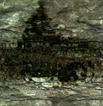 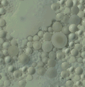

_Images suggesting water or shallow depths are useful as source textures for realistic WetTexture animations._

### Ice textures

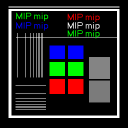 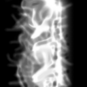 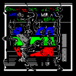

_A source texture, its displacement texture, and the resulting Ice texture._

Similar to the wet-texture effect, 'ice' displays a source texture with distortions, but these are taken from `GlassTexture`, which is
interpreted as an 8-bit distortion vector field. Both the `SourceTexture` and `GlassTexture` dimensions should match the Ice texture. In the
texture window, moving the mouse with the left button pressed drags the displacement 'ice layer' texture to the desired position. By setting
its `TimeMethod` parameter to `TIME_RealTimeScroll`, the animation speed you see in the editor matches the in-game speed exactly regardless
of the frame rate; it will skip intermediate panning positions if necessary.

Using specially constructed displacement textures, coupled with carefully tweaked panning directions, the potential range of original
effects using Ice textures is enormous. Oily swirls, fluid streams spiralling around each other, and effects that look like bump-mapping are
all possible.

The default setting of `TIME_FrameRateSync` will not give framerate-independent animations, but is still a good choice if you need
smoothness, since a once-per-frame update will ensure the texture moves a little bit every frame without big skips. The `MoveIce` switch
selects movement of either the `GlassTexture` or `SourceTexture`.

`HorizPanSpeed` and `VertPanSpeed` determine the movement in the `Linear` and` WavyX/Y` modes, with a zero-point of (128,128). `Frequency`
and `Amplitude` act on the speed and size of the circular and wavy parts of a texture's movements.

There are five modes of movement. All share the linear panning speed as set by `HorizPanSpeed` and `VertPanSpeed`

- `SLIDE_Linear`
    - Move a texture with speed settings HorizPanSpeed and VertPanSpeed.

- `SLIDE_Circular`
    - Circular movement using Frequency, around a radius equal to Amplitude.

- `SLIDE_Gestation`
    - Irregular movement using Frequency and Amplitude.

- `SLIDE_WavyX`
    - A wavy horizontal movement of Frequency and Amplitude.

- `SLIDE_WavyY`
    - A wavy vertical movement of Frequency and Amplitude.

Enjoy!
