## What is DeathBall

DeathBall is a top class "First Person Sport Game" that combines elements of Football/Soccer, Rugby and Handball.
It's currently a mod for UT2004, but it has nothing to do with a shooter and is a pure sports game.

### 2 Teams, 2 Goals, 1 Ball

In order to score, you need to shoot the ball into the opponent goal.

It's being played with about 5 players on each team, all controled by humans. Everybody plays his role on the team. Goal keeper, defender, attacker or whatever the team comes up with.

You have total control over what you do and you can no longer complain about the bad aiming of your PES or FIFA players.

Hard shots, complex volleys with frontspin, banana passes, it's all up to you.

At first it seems to be pretty simple, but the more you play it the more you realize how complex the gameplay is and how many possibilities your team has. The ways to score are infinite.

## Deathball Guide

  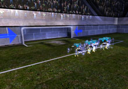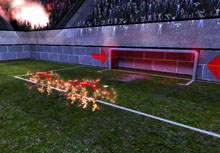

In order to win, you need to shoot the ball into the opponent goal. The team that scores the most goals wins the match. The goals are surrounded by the "penalty box", indicated by white lines on the ground.

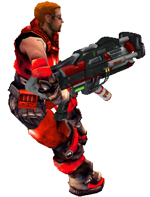

All players are carrying a hammer tool around. It creates a shock wave, which kicks the ball, but you can also catch it and launch a precise and hard shot.

If an opposing player is carrying the ball you can substract 60 of his health points by hitting him with the hammer shock wave.
If he's in your penalty box, you can immediately 'kill' him and make him respawn at his own penalty box.
In other cases you can only kick each other around without the loss of health.

ℹ️️ If you lose health, you will slowly regain it.

ℹ️ "Killing" enemy players is not necessarily a good thing, because they will reappear in their own defense, and might be annoying for you there.

To protect your own goal, you need good defensive tactics and a goal keeper.

  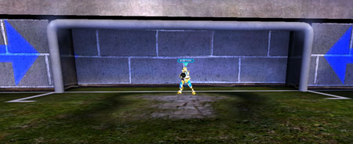

The goal keeper is the first person to enter the own penalty box. His skin is glowing yellowish, so you see who he is. The keeper has advantages over normal players:

- He can run faster than the others
- He can jump higher
- He can dodge (a quick, far side jump)
- Invincible, he cannot be hurt.

ℹ️️ To save a shot:

- he normally kicks the ball away with the hammer,
- catches the ball,
- or dodges into the face of the attacker and 'kills' him.

A player that carries the ball has red or blue rings around him (depending on his team color). To catch it, you just need to touch the ball.

  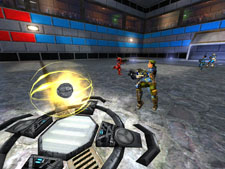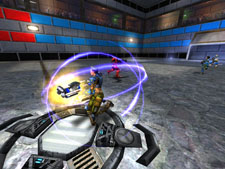

ℹ️️ If an opponent player shoots at you from a close distance, you can not catch it (Keepers can catch this...just normal field players can't).

### Shots

#### Shots without owning the ball:

- A **volley** shot. (The right timing is hard at first) Hit it when it's in front of you.
   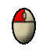
   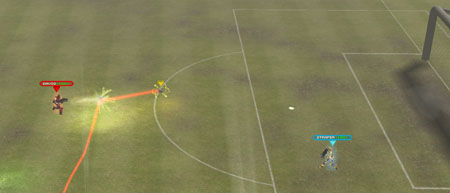
- Letting it **bounce** off your body (its not an actual shot).
   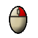
   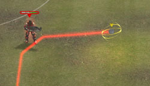 
  ℹ️️ Right mouse button always prevents you from catching the ball. If you use it on a still or slow ball, you can dribble it.

#### Shots that require you to carry the ball:

- A **charged** shot
   
   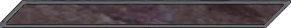
   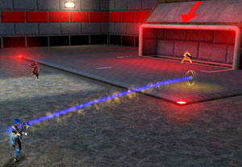
- An automatically aimed **pass**.
   At first you lock the player... (just aim at him)
   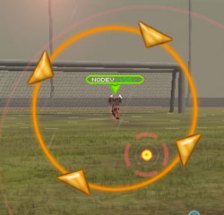
   Then pass...
   
   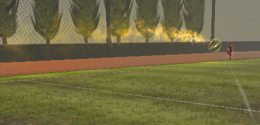
- If you don't lock a player, you can drop the ball out with low power.
   
- Last but not least the **dump** shot.
   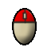
   _(hold right mouse, then click left mouse)_
   It requires no charging up and has medium power.
- **Volley** and charge shots can also be given spin which produces a lot more shot types. 
   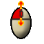
   _Depending on which keys you binded the spin modes, I suggest a 4-way-wheel-mouse (up, down, left, right)_
   You can add top spin, backspin and left/right spin.
  ℹ️️ You can only spin shots that require LMB (except dumping...but we might add that in a future release). 
  ℹ️️ The only shots that produce a red/blue trail are **volley**, **bounce** and **charge** shots. The rest only have yellow smoke. 

If you overpower charge shots, the ball will drop out with few power in a random direction. You need to stop charging right before it hits the end of the charge bar.

If you get hurt (owning the ball and being hit by an opponent player), you'll be shaking for a moment. There is a red bar that's emptying. If you try to charge or dump a shot before it's empty, it will result in a low power shot in a random direction (like the overpowered shot).

The main shots are **charged** and **pass**. Learn to use them before you start with the others.

### Head Up Display

  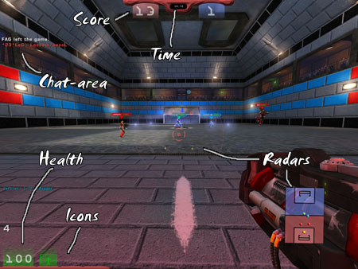

#### The bottom radar

  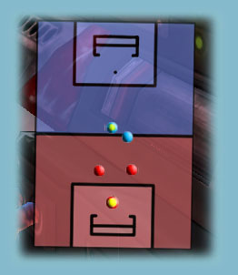

Here you see all players, the ball and the destination point for automatic passes (last one is not in the image).

ℹ️️ While playing you should be looking at the radar for about 50% of the time. You need it for a good tactical view. You can also precisely play long passes with a charge shot just by looking at this radar.

#### The middle radar

  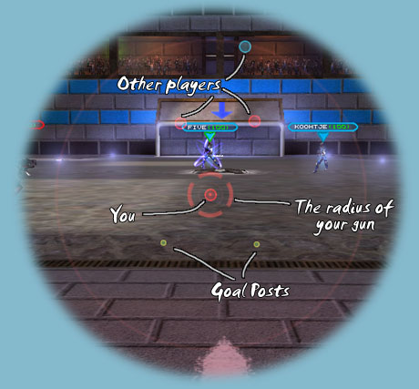

This is to see your immediate environment. It's perfect to use for tacklings and volley shots, because the middle circle indicates your hammer shock wave radius.

It also shows the height of the ball. (Cannot be seen in this image).

It's also very important for keepers, because they see the posts of their own goal behind them.

ℹ️️ No good player can live without it, because it adds a lot to your vision, although it might be a bit annoying at first. When you first use it, it seems to block your view, but trust me: leave it on and learn to use it! 

### Movement

The suggested default controls for movement are the WASD keys. 

**W** and **S** to move forward and backward. **A** and **D** to strafe left and right.

- Move the mouse to determine where you are looking/aiming.
- In order to dodge (only for goal keepers) you need to tap a direction key twice, depending on the direction in which you want to dodge.
- The Space bar is for jumping.

#### Other keys

- **ESC** - Here you can 'change team' (top middle), switch to spectating, or simple leave the game and lots of other options.
- **F1** - A list of all players including ping and countless statistics. You can also see the match limit (how long it takes or how many goals you need to score).
- **F2**- Rules - Here you can watch the server rules.
   ℹ️️ Match ending rules, amount of goal replays etc.
- **F3** - The statistic screen (self explaining?)
   ℹ️️ Don't play for stats and don't brag with them. Especially the awards are inaccurate and mostly don't REALLY indicate who's best.
- **F4** - Lists the Spectators
- **T** - chat with all
- **R** - to chat only with your team

### Tips

- The first thing you will have to learn is to **boost**:
   It's about kicking your team mates with your hammer, in order to get faster across the pitch (to the ball, back to defense, to attack, to an enemy player..).
   If you boost someone, only do it when he's running away from you, that way he'll fly much further than when he's standing still.
   Once you are in the air use your multijumps so get further away.
   ℹ️️ You can also perform a double boost with a good team. If you have 3 players in about a line, the last player can kick the middle player to the front player. The front player boost the flying player again. That way he gets very very far.
- It's all about **teamplay**. If you play egoistically, you will ruin the match for your team.
- There are unlimited tactics, moves and tricks. Even after years there are always being found new things. Go creative with your team!
   To define text **binds** (for orders etc) do this
   Use the tab key.
   Then type something like: `set input e teamsay Boost!`
   If you type **e** ingame now you will say **"Boost!"** to your teammates now.
- For better teamplay I suggest putting "text to speech" on.
   So instead of reading the tactical orders of your teammates, you hear them being said, so you can react quicker.
   ℹ️️ In options/audio select "enable in game".
  I suggest also checking "only team messages", because it gets annoying if all the rest is being said too.
   ℹ️️ Once you have text to speech on, say things like:
  "nnnnnnnnnn ride with me on my bike mmmmmmmmo! eqqqqqqqqqq" Just 'cuz it sounds funny :D
- People tend to boost each other to the middle right after each kick off. If your team just scored, do NOT boost there. Because the opponent team spawns with the ball, and they are attacking. Don't kick your defense away!
- Before you play a pass or try something else that will most likely not work, rather **pass back**. Don't hesitate to play a high lob back to your own keeper.
   Preventing the opponent team from having the ball is better than wasting your possession and allowing the other team to start an attack. Patience wins. 
- Always mark from behind. Never stand in front of the players (only in rare occasions).
- If you are **man-marking** an open player in defense, do your team a favour and *do not kick* the "enemy" player around and make sure he can't kick you. (Once you kick him, he will be in open space...same if he kicks you). Instead try to keep a little distance and only kick him once he is about to receive a ball.
   ℹ️️ If someone happens to get behind you, don't run back into him. That will make things worse, because he can just hit you out of the way.
- On our forums you can get more help, tips and find a team (or look for players for your team).
